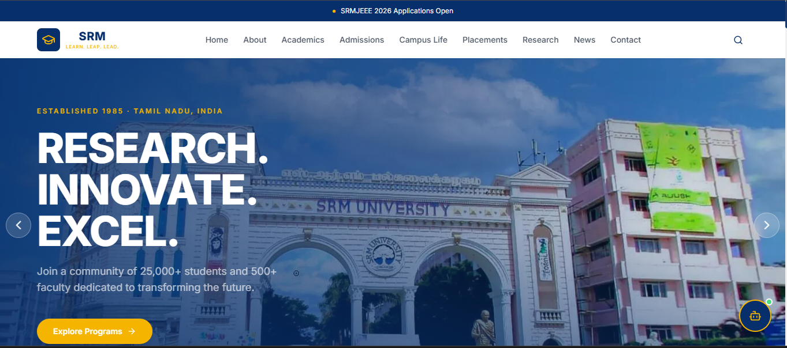

# 🎓 SRM Institute of Science and Technology - Website Clone

A modern, responsive, and minimal recreation of the **SRM Institute of Science and Technology (SRMIST)** official website built using **React, TypeScript, Tailwind CSS, and Vite**.

This project recreates the visual identity and user experience of the official SRM website while incorporating a cleaner layout, improved responsiveness, and modern frontend practices.

> ⚠️ **Disclaimer:** This project is developed for educational and learning purposes only. It is an independent frontend recreation and is not affiliated with or endorsed by SRM Institute of Science and Technology.

---

## 🌐 Live Demo

🚀 **Website:** https://srm-website-olive.vercel.app

---

## 📸 Preview



---

# ✨ Features

- 🎨 Modern SRM-inspired user interface
- 📱 Fully responsive design
- 🖼️ Hero image carousel
- 🔍 Smart search panel
- 📊 Animated statistics section
- 📰 Latest News & Upcoming Events
- 🎓 Academic Programs section
- 🎯 Admissions highlights
- 💼 Placements & Industry Connect
- 🔬 Research & Innovation
- 🏆 Rankings & Accreditation
- 🌳 Campus Life section
- 🖼️ Campus Gallery
- 💬 Floating AI Chatbot UI
- ⚡ Smooth scrolling navigation
- 🎭 Beautiful animations using Framer Motion
- 🌙 Clean, minimal, and professional design

---

# 🛠️ Tech Stack

| Technology | Purpose |
|------------|---------|
| React | Frontend Library |
| TypeScript | Type Safety |
| Vite | Build Tool |
| Tailwind CSS | Styling |
| Framer Motion | Animations |
| React Icons | Icons |
| Vercel | Deployment |

---

# 📂 Project Structure

```text
srm-website/
│
├── docs/
│   └── preview.png
│
├── public/
│   └── images/
│       ├── hero/
│       ├── campus-life/
│       ├── gallery/
│       └── research/
│
├── src/
│   ├── components/
│   │   ├── layout/
│   │   ├── sections/
│   │   ├── ui/
│   │   └── chatbot/
│   │
│   ├── data/
│   ├── hooks/
│   ├── utils/
│   ├── App.tsx
│   ├── main.tsx
│   └── index.css
│
├── index.html
├── package.json
├── vite.config.ts
├── tailwind.config.js
└── README.md
```

---

# 🚀 Getting Started

## 1️⃣ Clone the Repository

```bash
git clone https://github.com/Rakavi-07/srm-website.git
```

---

## 2️⃣ Navigate into the Project

```bash
cd srm-website
```

---

## 3️⃣ Install Dependencies

```bash
npm install
```

---

## 4️⃣ Start the Development Server

```bash
npm run dev
```

Open your browser and visit:

```
http://localhost:5173
```

---

# 📦 Production Build

Generate an optimized production build using:

```bash
npm run build
```

Preview the production build locally:

```bash
npm run preview
```

---

# 🌍 Deployment

This project is deployed on **Vercel**.

### Live Website

https://srm-website-olive.vercel.app

---

# 🎯 Website Sections

- Home
- About
- Academic Programs
- Admissions
- Placements
- Research & Innovation
- Rankings & Accreditation
- Campus Life
- Latest News
- Upcoming Events
- Gallery
- Footer

---

# 📱 Responsive Design

The website is optimized for:

- 💻 Desktop
- 🖥️ Laptop
- 📱 Mobile
- 📲 Tablet

---

# 📈 Future Enhancements

- 🤖 AI-powered chatbot
- 🔍 Intelligent search functionality
- 👨‍🎓 Student login portal
- 📝 Online admission application
- 🔐 Authentication system
- 📢 Dynamic news management
- 🌐 Backend API integration
- 📚 ERP integration
- 🗂️ Content Management System (CMS)

---

# 📚 Learning Objectives

This project helped explore and practice:

- React Component Architecture
- TypeScript Development
- Tailwind CSS Styling
- Responsive Web Design
- Smooth Scrolling Navigation
- Modern UI/UX Principles
- Deployment using Vercel
- Git & GitHub Workflow

---

# 🤝 Contributing

Contributions, suggestions, and improvements are always welcome.

1. Fork the repository.
2. Create a new branch.
3. Commit your changes.
4. Push to your branch.
5. Open a Pull Request.

---

# 📄 License

This project is intended for **educational and personal learning purposes only**.

All trademarks, logos, and official SRM branding belong to their respective owners.

---

# 👩‍💻 Author

**Rakavi**

🎓 B.Tech Computer Science Engineering

🔗 GitHub: https://github.com/Rakavi-07

🌐 Live Demo: https://srm-website-olive.vercel.app

---

## ⭐ Support

If you found this project helpful, consider giving it a **⭐ Star** on GitHub.

It helps support the project and encourages future improvements.

---

### Made with ❤️ using React, TypeScript, Tailwind CSS & Vite
